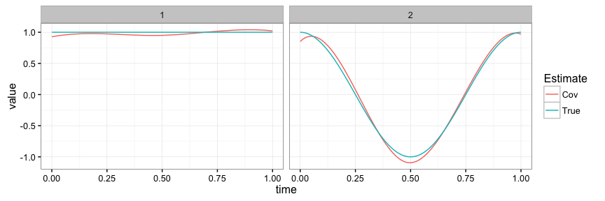

<!-- README.md is generated from README.Rmd. Please edit that file -->
vbvs.concurrent: Fitting Methods for the Functional Linear Concurrent Model
---------------------------------------------------------------------------

[](https://travis-ci.org/jeff-goldsmith/vbvs.concurrent) [](https://codecov.io/gh/jeff-goldsmith/vbvs.concurrent?branch=master)

Author: Jeff Goldsmith

License: [GPL-3](https://opensource.org/licenses/GPL-3.0)

Version: 0.1

------------------------------------------------------------------------

Functional data analysis is concerned with understanding measurements made over time, space, frequencies, and other domains for multiple subjects. Given the ubiquity of wearable devices, it is common to obtain several data streams monitoring blood pressure, physical activity, heart rate, location, and other quantities on study participants in parallel. Each of these data streams can be thought of as functional data, and the functional linear concurrent model is useful for relating predictor data to an outcome.

This package implements two statistical methods (with and without variable selection) for estimating the parameters in the functional linear concurrent model; these methods are described in detail [here](http://jeffgoldsmith.com/Downloads/VBVS.pdf). Additional functions to create predictions based on parameter estimates, to extract model coefficients, and to choose tuning parameters via cross validation are included. Interactive visualizations are supported through the [refund.shiny](https://github.com/refunders/refund.shiny) package.

### Installation

------------------------------------------------------------------------

You can install the latest version directly from GitHub with [devtools](https://github.com/hadley/devtools):

``` r
install.packages("devtools")
devtools::install_github("jeff-goldsmith/vbvs.concurrent")
```

Interactive plotting is implemented through [refund.shiny](https://github.com/refunders/refund.shiny), which can be installed from CRAN or GitHub.

### Example of use

------------------------------------------------------------------------

The code below simulates a dataset under the functional linear concurrent model. For each of 50 subjects, observations of two predictor functions and a response function are observed over times between 0 and 1. The predictors and the coefficients that relate them to the response vary over time.

``` r
library(tidyverse)

## set design elements
set.seed(1)
I = 50
p = 2

## coefficient functions
beta1 = function(t) { 1 }
beta2 = function(t) { cos(2*t*pi) }

## generate subjects and observation times
concurrent.data = 
  data.frame(
    subj = rep(1:I, each = 20)
  ) %>%
  mutate(time = runif(dim(.)[1])) %>%
  arrange(subj, time) %>%
  group_by(subj) %>%
    mutate(Cov_1 = runif(1, .5, 1.5) * sin(2 * pi * time),
           Cov_2 = runif(1, 0, 1) + runif(1, -.5, 2) * time,
           Y = Cov_1 * beta1(time) + 
               Cov_2 * beta2(time) +
               rnorm(20, 0, .5)) %>%
  ungroup()
```

The plot below shows the predictors and the response, highlighting four subjects.


To fit the functional linear concurrent model, we can use `vb_concurrent`. Alternatively, we can use `vbvs_concurrent` which is similar but adds variable selection to the estimation approach.

``` r
library(vbvs.concurrent)

fit_vb = vb_concurrent(Y ~ Cov_1 + Cov_2 | time, id.var = "subj", data = concurrent.data, 
                       t.min = 0, t.max = 1, standardized = TRUE)
#> Constructing Xstar; doing data organization 
#> Beginning Algorithm 
#> ..........
fit_vbvs = vbvs_concurrent(Y ~ Cov_1 + Cov_2 | time, id.var = "subj", data = concurrent.data, 
                           t.min = 0, t.max = 1, standardized = TRUE)
#> Constructing Xstar; doing data organization 
#> Beginning Algorithm 
#> ..........
```

The plot below shows true coefficients and estimates without using variable selection.



Interactive graphics show observed data, coefficient functions, and residual curves. The code below will produce such a graphic.

``` r
library(refund.shiny)

plot_shiny(fit_vb)
plot_shiny(fit_vbvs)
```

### Contributions

------------------------------------------------------------------------

If you find small bugs, larger issues, or have suggestions, please file them using the [issue tracker](https://github.com/jeff-goldsmith/vbvs.concurrent/issues) or email the maintainer at <jeff.goldsmith@columbia.edu>. Contributions (via pull requests or otherwise) are welcome.
